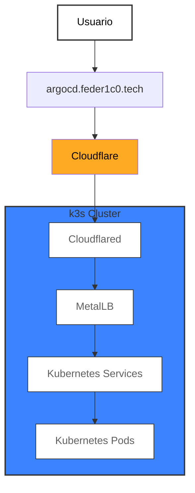

# 🏠 HomeLab - Kubernetes y GitOps para experimentar

[](https://creativecommons.org/licenses/by-nc-sa/4.0/)
[](https://kubernetes.io/)
[](https://argoproj.github.io/argo-cd/)
[](https://github.com/fede-r1c0/homelab)

## 📋 Descripción

Este repositorio contiene la configuración completa de un homelab Kubernetes basado en GitOps. La arquitectura utiliza **k3s** como distribución ligera de Kubernetes, **Cilium** como CNI, **ArgoCD** para GitOps, y un stack completo de herramientas para observabilidad, seguridad y desarrollo.

El objetivo es proporcionar un entorno de aprendizaje y experimentación que sea fácil de reproducir, modificar y mantener, siguiendo las mejores prácticas de la industria.

## 🎯 Características

- ✅ **Kubernetes ligero**: k3s optimizado para arm64/Raspberry Pi
- ✅ **GitOps completo**: ArgoCD con patrón App of Apps
- ✅ **Seguridad**: Sealed Secrets para gestión segura de credenciales
- ✅ **Observabilidad**: Stack completo de Prometheus, Grafana y Alertmanager
- ✅ **Desarrollo**: Backstage como Internal Developer Portal
- ✅ **Conectividad**: Cloudflare Tunnel para acceso seguro desde internet
- ✅ **Documentación**: Guías paso a paso para cada componente

## 🏗️ Arquitectura



### Componentes Principales

| Componente | Propósito | Tecnología |
|------------|-----------|------------|
| **Cloudflare** | DNS, SSL/TLS, DDoS Protection, CDN Global | Cloudflare Tunnel |
| **Cloudflared** | Cliente del túnel, ingress point | DaemonSet en k3s |
| **MetalLB** | Load Balancer para bare metal | L2 Mode + IP Pool |
| **k3s** | Distribución ligera de Kubernetes | CNCF Project |
| **Cilium** | CNI, Network Policies, Observabilidad | eBPF-based |
| **ArgoCD** | GitOps y gestión de aplicaciones | App of Apps pattern |
| **Sealed Secrets** | Gestión segura de credenciales | Bitnami Labs |
| **Prometheus Stack** | Monitoreo, alertas y visualización | Prometheus + Grafana |
| **Backstage** | Internal Developer Portal | Spotify/CNCF |

## 🚀 Instalación Rápida

### Prerrequisitos

- **Hardware**: Raspberry Pi 5 (recomendado) o cualquier equipo arm64/x86_64
- **OS**: Raspberry Pi OS Lite, Ubuntu Server, o cualquier distribución Linux
- **Red**: Conexión a internet y acceso SSH
- **Dominio**: Dominio configurado en Cloudflare (para Cloudflare Tunnel)

### 1. Preparar el Sistema

```bash
# Habilitar cgroups para Kubernetes
echo 'cgroup_memory=1 cgroup_enable=memory' | sudo tee -a /boot/firmware/cmdline.txt

# Instalar dependencias del kernel
sudo apt update && sudo apt install -y linux-modules-extra-raspi
```

### 2. Instalar k3s

```bash
# Instalar k3s (usaremos Cilium)
curl -sfL https://get.k3s.io | INSTALL_K3S_EXEC="--flannel-backend=none --disable-kube-proxy --disable servicelb --disable-network-policy --disable=traefik" sh -

# Configurar kubeconfig
mkdir -p ~/.kube
sudo cp /etc/rancher/k3s/k3s.yaml ~/.kube/config
sudo chown $USER:$USER ~/.kube/config

# Verificar instalación
kubectl get nodes
```

### 3. Instalar Cilium

```bash
# Instalar Helm
curl https://raw.githubusercontent.com/helm/helm/main/scripts/get-helm-3 | bash

# Instalar Cilium
helm repo add cilium https://helm.cilium.io/
helm install cilium cilium/cilium \
  --namespace kube-system \
  --set kubeProxyReplacement=true \
  --set k8sServiceHost=127.0.0.1 \
  --set k8sServicePort=6443 \
  --set operator.replicas=1 \
  --set hubble.enabled=true \
  --set prometheus.enabled=true

# Instalar Cilium CLI
curl -L --remote-name-all https://github.com/cilium/cilium-cli/releases/latest/download/cilium-linux-arm64.tar.gz
tar xzvfC cilium-linux-arm64.tar.gz /usr/local/bin
rm cilium-linux-arm64.tar.gz

# Verificar Cilium
cilium status
cilium connectivity test

# Verificar métricas
kubectl get pods -n kube-system -l k8s-app=cilium
kubectl get pods -n kube-system -l k8s-app=hubble-relay
```

### 4. Instalar ArgoCD

```bash
# Instalar ArgoCD
helm repo add argo https://argoproj.github.io/argo-helm
helm install argocd argo/argo-cd \
  --namespace argocd \
  --create-namespace \
  --values apps/argo/argocd/values.yaml \
  --wait

# Obtener contraseña de admin
kubectl -n argocd get secret argocd-initial-admin-secret -o jsonpath="{.data.password}" | base64 -d
```

### 5. Bootstrap del HomeLab (ArgoCD App of Apps)

```bash
# Instalar la aplicación bootstrap que configurará todo automáticamente
helm install argocd-apps argo/argocd-apps \
  --namespace argocd \
  --values apps/argo/argocd-apps/values.yaml \
  --wait
```

#### **Importante**

Estos 5 pasos estan pensados para reproducir el entorno de manera automatica con los archivos de configuracion actualizados en el directorio `apps/`.  

Para una primera instalación, es necesario generar antes los secretos `[*]-sealedsecret.yaml` para cada servicio con **TUS** respectivas credenciales o información sensible.

## 🔧 Configuración Automática

Una vez instalado ArgoCD, la aplicación `homelab-bootstrap` configurará automáticamente todos los servicios del homelab:

| Servicio | Propósito | Estado |
|----------|-----------|---------|
| **Sealed Secrets** | Gestión segura de credenciales | ✅ Automático |
| **MetalLB** | Load Balancer para bare metal | ✅ Automático |
| **Prometheus Stack** | Observabilidad y monitoreo | ✅ Automático |
| **Backstage** | Internal Developer Portal | ✅ Automático |
| **Cloudflare Tunnel** | Acceso seguro desde internet | ✅ Automático |

### Configuración de Credenciales

**Importante**: Antes de que ArgoCD pueda configurar los servicios, debes:

1. **Configurar Sealed Secrets**: [docs/04 - sealed-secrets-setup.md](docs/04%20-%20sealed-secrets-setup.md)
2. **Preparar los archivos de credenciales** para cada servicio:
   - `apps/prometheus-stack/grafana-sealedsecret.yaml`
   - `apps/cloudflared/cloudflared-sealedsecret.yaml`
   - `apps/backstage/backstage-sealedsecret.yaml`

3. **Validar los values.yaml** de cada aplicación en `apps/`

## 📁 Estructura del Repo

```bash
homelab/
├── .github/                     # Workflows de GitHub Actions
│   └── workflows/                 # Validación automática de manifiestos
├── apps/                        # Configuraciones de aplicaciones
│   ├── argo/                      # Instalación de ArgoCD y argocd-apps Helm Chart
│   │   ├── argocd/                  # Values para argocd Helm Chart
│   │   └── argocd-apps/             # Values para argocd-apps Helm Chart
│   ├── backstage/                 # Configuración de Backstage
│   ├── cloudflared/               # Configuración de Cloudflare Tunnel
│   ├── metallb/                   # Configuración de MetalLB
│   ├── prometheus-stack/          # Configuración de Prometheus Stack
│   └── sealed-secrets/            # Configuración de Sealed Secrets
├── argocd/                      # Manifiestos de configuración de ArgoCD
│   ├── applications/              # Aplicaciones individuales
│   └── projects/                  # Definición de proyectos con RBAC
├── docs/                        # Documentación técnica detallada
└── README.md                    # Este archivo
```

## 🔧 Personalización

### Agregar nuevas Apps a ArgoCD

Para agregar una nueva aplicación al homelab:

1. **Crear directorio en `apps/`** con tu configuración:

   ```bash
   mkdir apps/mi-nueva-app
   # Crear values.yaml con la configuración
   # Crear [app-name]-sealedsecret.yaml si necesita credenciales
   ```

2. **Crear aplicación en `argocd/applications/`**:

   ```yaml
   apiVersion: argoproj.io/v1alpha1
   kind: Application
   metadata:
     name: mi-nueva-app
     namespace: argocd
   spec:
     project: applications
     source:
       repoURL: https://github.com/fede-r1c0/homelab
       targetRevision: HEAD
       path: apps/mi-nueva-app # Path al directorio de la nueva app
     destination:
       server: https://kubernetes.default.svc
       namespace: mi-nueva-app
     syncPolicy:
       automated:
         prune: true
         selfHeal: true
   ```

3. **Commit y push** → ArgoCD la detecta automáticamente

### Modificar Configuración Existente

- **Apps**: Edita `values.yaml` en `apps/[nombre-app]/`
- **ArgoCD**: Modifica archivos en `argocd/applications/` y `argocd/projects/`
- **Documentación**: Actualiza archivos en `docs/`

### Estructura de una App en ArgoCD

Cada aplicación debe seguir esta estructura:

```bash
apps/mi-app/
├── values.yaml                  # Configuración principal (Helm values)
├── mi-app-sealedsecret.yaml    # Credenciales encriptadas (si aplica)
└── README.md                   # Documentación específica (opcional)
```

## 📚 Documentación Detallada

Para configuraciones específicas y troubleshooting, consulta la documentación completa:

- **[00 - Raspberry Pi Setup](docs/00%20-%20raspberry-pi-setup.md)** - Preparación del sistema
- **[01 - k3s Installation](docs/01%20-%20k3s-installation.md)** - Instalación de Kubernetes
- **[02 - Cilium Installation](docs/02%20-%20cilium-installation.md)** - Configuración de red
- **[03 - ArgoCD Installation](docs/03%20-%20argocd-installation.md)** - GitOps y automatización
- **[04 - Sealed Secrets Setup](docs/04%20-%20sealed-secrets-setup.md)** - Gestión segura de secretos
- **[05 - MetalLB Setup](docs/05%20-%20metallb-setup.md)** - Load balancing
- **[05 - Prometheus Stack Setup](docs/05%20-%20prometheus-stack-setup.md)** - Observabilidad
- **[06 - Backstage Setup](docs/06%20-%20backstage-setup.md)** - Developer Portal
- **[07 - Cloudflare Tunnel Setup](docs/07%20-%20cloudflared-setup.md)** - Acceso desde internet

## 🌐 Acceso a Servicios

Con la configuración completa, los servicios estarán disponibles en:

| Servicio | URL | Propósito |
|----------|-----|-----------|
| **ArgoCD** | `https://argocd.feder1c0.tech` | GitOps y gestión de aplicaciones |
| **Grafana** | `https://grafana.feder1c0.tech` | Dashboards y visualización |
| **Backstage** | `https://backstage.feder1c0.tech` | Developer Portal |

## 🚨 Troubleshooting Rápido

### Verificar Estado General

```bash
# Estado del cluster
kubectl get nodes
kubectl get pods --all-namespaces

# Estado de ArgoCD
kubectl get applications -n argocd
kubectl get pods -n argocd
```

### Problemas Comunes

- **Apps en OutOfSync**: Verificar logs de ArgoCD y validar manifiestos
- **Pods no arrancan**: Verificar recursos disponibles y eventos del cluster
- **Servicios no accesibles**: Verificar MetalLB y Cloudflare Tunnel

Para troubleshooting detallado, consulta la documentación específica de cada componente.

## 🔒 Seguridad

- **Sealed Secrets**: Todas las credenciales están encriptadas
- **RBAC**: Control de acceso basado en roles implementado
- **Network Policies**: Cilium proporciona políticas de red avanzadas
- **Zero Trust**: Cloudflare Access para control de acceso a servicios

## 📊 Monitoreo

- **Prometheus**: Recolección de métricas del cluster y aplicaciones
- **Grafana**: Dashboards predefinidos para Kubernetes
- **Alertmanager**: Alertas configurables para eventos críticos
- **Cilium Hubble**: Observabilidad de red en tiempo real

## 🤝 Contribuir

Este proyecto fomenta las contribuciones y mejoras. Para contribuir:

1. **Fork** del repositorio
2. **Crea una rama** para tu feature (`git checkout -b feature/AmazingFeature`)
3. **Commit** tus cambios (`git commit -m 'Add some AmazingFeature'`)
4. **Push** a la rama (`git push origin feature/AmazingFeature`)
5. **Abre un Pull Request**

## 📜 Licencia

[](https://creativecommons.org/licenses/by-nc-sa/4.0/)

Este proyecto está bajo la licencia **Creative Commons BY-NC-SA 4.0**.

- ✅ **Permitido**: Uso personal, educativo, modificaciones y distribución
- ❌ **No permitido**: Uso comercial sin autorización
- 📋 **Requerido**: Atribución al autor original

## 📚 Recursos Adicionales

- [k3s Documentation](https://docs.k3s.io/)
- [Cilium Documentation](https://docs.cilium.io/)
- [ArgoCD Documentation](https://argo-cd.readthedocs.io/)
- [Sealed Secrets](https://github.com/bitnami-labs/sealed-secrets)
- [Cloudflare Tunnel](https://developers.cloudflare.com/cloudflare-one/connections/connect-apps/)

## 🙏 Agradecimientos

- **CNCF** por los excelentes proyectos de código abierto
- **Comunidad Kubernetes** por la documentación y soporte

---

**¿Listo para construir tu propio homelab?** 🚀

Si este proyecto te ha sido útil, considera darle una ⭐ en GitHub y compartirlo con la comunidad.
